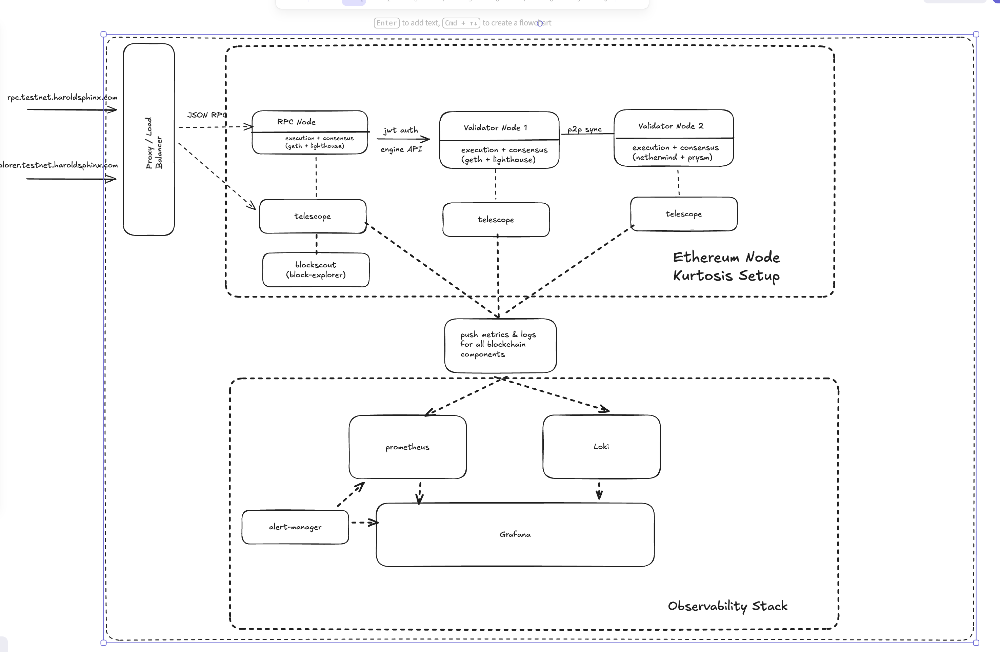

# zama-pevm-testnet

Private Ethereum testnet with geth + lighthouse across multiple VMs. Nodes peer via shared genesis.

## Architecture



[Telescope](https://github.com/blockopsnetwork/telescope) ships metrics and logs to monitoring.

## Setup

### 1. Generate genesis

```sh
./scripts/generate-genesis.sh
```

### 2. Get bootnode pubkey

After genesis generation, get the pubkey from node-1's key:
```sh
docker run --rm -v $(pwd)/genesis/nodekeys:/keys ethereum/client-go:v1.15.2 \
  bootnode -nodekey=/keys/node-1.key -writeaddress
```

### 3. Deploy

```sh
cd terraform/environments/testnet
cp terraform.tfvars.example terraform.tfvars
# set bootnode_pubkey from step 2

terraform init && terraform apply
```

## Ports

| Port | Service |
|------|---------|
| 8545 | JSON-RPC |
| 5052 | Lighthouse API |
| 4000 | Blockscout |
| 3000 | Grafana |
| 9090 | Prometheus |

## Verify

```sh
# check peers
ssh ubuntu@<IP> 'docker exec geth geth attach --exec "admin.peers.length"'

# check blocks
curl -s http://<RPC_IP>:8545 -X POST -H "Content-Type: application/json" \
  -d '{"jsonrpc":"2.0","method":"eth_blockNumber","id":1}'
```

## Teardown

```sh
terraform destroy
```
