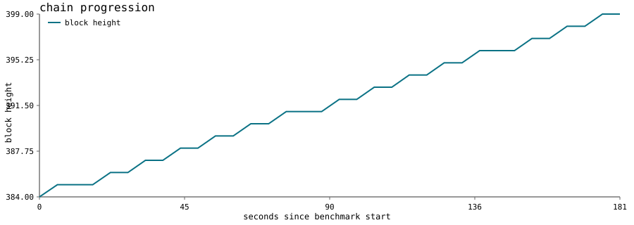
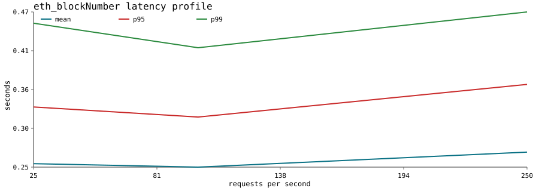
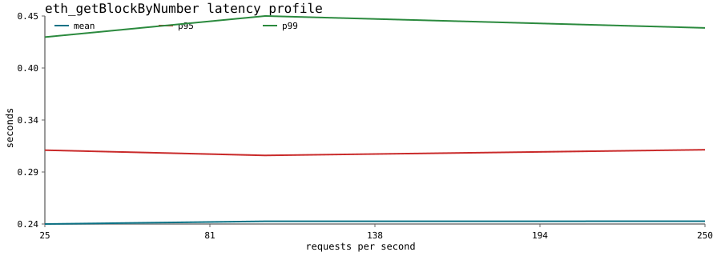
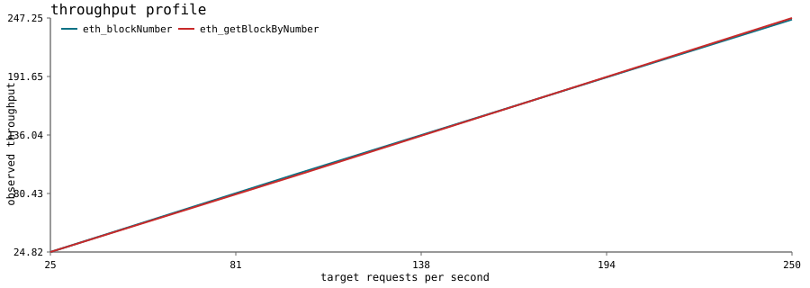

# Baseline Benchmark Report

- Run directory: `results/current/20260408T195122Z`
- EL client: `Geth/v1.16.8-stable-abeb78c6/linux-amd64/go1.24.11`
- CL client: `Lighthouse/v8.1.0-edba56b/x86_64-linux`
- Target RPC URL: `http://52.44.40.113:8545`
- Request rates: `[25, 100, 250]`
- Duration per rate: `30` seconds

## What The Baseline Means

This baseline is the pre-upgrade performance profile of the currently deployed network. It shows how the RPC node behaved under fixed-rate JSON-RPC load and whether the chain kept advancing while that load was applied.

## Liveness

- Starting block: `384`
- Ending block: `399`
- Block delta during run: `15`
- Average seconds per observed block increase: `12.0592`
- Stall detected: `no`

## RPC Metrics

### eth_blockNumber

| Rate | Mean | p50 | p95 | p99 | Throughput | Error Rate |
| ---: | ---: | ---: | ---: | ---: | ---: | ---: |
| 25 | 0.2503 | 0.2395 | 0.3314 | 0.4513 | 24.8178 | 0.0000 |
| 100 | 0.2454 | 0.2338 | 0.3170 | 0.4162 | 99.3384 | 0.0000 |
| 250 | 0.2669 | 0.2580 | 0.3637 | 0.4674 | 245.8383 | 0.0000 |

### eth_getBlockByNumber

| Rate | Mean | p50 | p95 | p99 | Throughput | Error Rate |
| ---: | ---: | ---: | ---: | ---: | ---: | ---: |
| 25 | 0.2408 | 0.2276 | 0.3139 | 0.4258 | 24.8249 | 0.0000 |
| 100 | 0.2435 | 0.2261 | 0.3087 | 0.4467 | 97.9881 | 0.0000 |
| 250 | 0.2435 | 0.2262 | 0.3143 | 0.4349 | 247.2550 | 0.0000 |

### Throughput Across Tests

